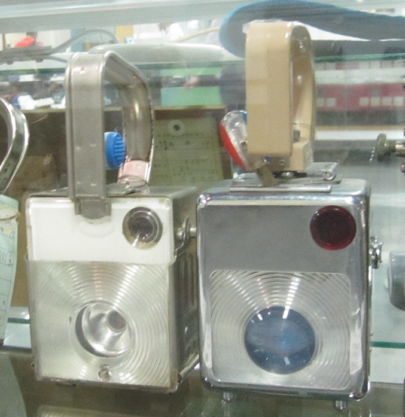
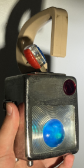

## Introduction
My grandfather worked his entire career as a conductor for the JR Group in Japan. One souvenir he gifted us was his old railway signal lamp.
 
## Key Constraints
* The signal light is [very rare](https://web.archive.org/web/20230908053131/https://www.ebay.com/itm/175180742205) mechanism, so even if spare parts are available it may be impossible to source them.
* The signal light is fragile because of it's age.
## Process
I started by freeing the clasps from either side and pulling out the rear assembly. An advantage of this being an analog device is it's easy to repair design.
